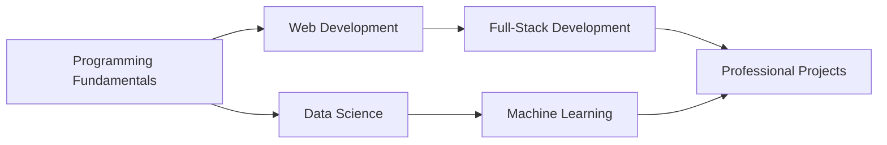

# 🎓 Professional Certifications & Achievements

> A comprehensive collection of my professional certifications and training accomplishments across **Web Development**, **Data Science**, **Machine Learning**, and **Software Engineering**. Includes international conference paper presentations and research contributions.

---

## 📋 Table of Contents

- [Overview](#overview)
- [Certifications by Category](#certifications-by-category)
  - [Web Development](#-web-development)
  - [Programming Languages](#-programming-languages)
  - [Data Science & Machine Learning](#-data-science--machine-learning)
  - [Conferences & Workshops](#-conferences--workshops)
- [Skills Summary](#-skills-summary)
- [Contact](#-contact)

---

## 🎯 Overview

This repository showcases my commitment to continuous learning and professional development. Each certificate represents hands-on training, practical projects, and demonstrated competency in modern technologies and frameworks.

**Total Certifications:** 13  
**Focus Areas:** Full-Stack Development, Data Science, Machine Learning, Python, JavaScript, Mobile Development  
**Learning Platforms:** Coursera (Stanford University), DataCamp, KnowledgeGate, CUET, Bangladesh Computer Council

---

## 🎤 Research & Conference Highlights

- **📝 International Conference Paper Presentations**
  - **ECCE 2025** - International Conference on Electrical, Computer and Communication Engineering
  - **ICDSAIA** - International Conference on Data Science, AI and Applications
- **🏆 3 Minute Thesis (3MT) Bangladesh 2025** - Research Communication Competition
- **💡 Software Engineering Best Practices Workshop** - CUET & Kolpolok Ltd.

---

## 📚 Certifications by Category

### 🌐 Web Development

<table>
  <tr>
    <th>Certificate</th>
    <th>Skills Covered</th>
    <th>View</th>
  </tr>
  <tr>
    <td><b>Mobile App Development (Android/Flutter/iOS)</b></td>
    <td>Android, Flutter, iOS Development, Mobile UI/UX (80 hours)</td>
    <td><a href="./Web_Development/App_Development_Course.pdf">📄 View Certificate</a></td>
  </tr>
  <tr>
    <td colspan="3"><i>Issued by: Bangladesh Computer Council, ICT Division | CUET | EDGE Project</i></td>
  </tr>
  <tr>
    <td><b>Node.js + Express.js + MongoDB</b></td>
    <td>Backend Development, REST APIs, Database Management</td>
    <td><a href="./Web_Development/NodeJS_ExpressJS_MongoDB_Course.pdf">📄 View Certificate</a></td>
  </tr>
  <tr>
    <td colspan="3"><i>Issued by: KnowledgeGate</i></td>
  </tr>
  <tr>
    <td><b>React & Redux</b></td>
    <td>Frontend Development, State Management, Component Architecture</td>
    <td><a href="./Web_Development/React_Redux_Course.pdf">📄 View Certificate</a></td>
  </tr>
  <tr>
    <td colspan="3"><i>Issued by: KnowledgeGate</i></td>
  </tr>
  <tr>
    <td><b>GitHub Course</b></td>
    <td>Version Control, Collaboration, CI/CD, Git Workflows</td>
    <td><a href="./Web_Development/GitHub_Course.pdf">📄 View Certificate</a></td>
  </tr>
  <tr>
    <td colspan="3"><i>Issued by: DataCamp</i></td>
  </tr>
</table>

**Key Technologies:** Node.js, Express.js, React, Redux, MongoDB, GitHub, REST APIs, Android, Flutter, iOS

---

### 💻 Programming Languages

<table>
  <tr>
    <th>Certificate</th>
    <th>Skills Covered</th>
    <th>View</th>
  </tr>
  <tr>
    <td><b>Complete Java Course</b></td>
    <td>OOP, Data Structures, Algorithms, Java Fundamentals (Score: 95%)</td>
    <td><a href="./Programming_Languages/Java_Complete_Course.pdf">📄 View Certificate</a></td>
  </tr>
  <tr>
    <td colspan="3"><i>Issued by: KnowledgeGate</i></td>
  </tr>
  <tr>
    <td><b>Python Programming Fundamentals</b></td>
    <td>Python Syntax, Functions, Modules, Best Practices (13 hours)</td>
    <td><a href="./Programming_Languages/Python_Fundamentals_Skill_Track.pdf">📄 View Certificate</a></td>
  </tr>
  <tr>
    <td colspan="3"><i>Issued by: DataCamp</i></td>
  </tr>
</table>

**Key Technologies:** Java, Python, OOP, Data Structures

---

### 🤖 Data Science & Machine Learning

<table>
  <tr>
    <th>Certificate</th>
    <th>Skills Covered</th>
    <th>View</th>
  </tr>
  <tr>
    <td><b>Machine Learning Specialization</b></td>
    <td>Supervised Learning, Neural Networks, Decision Trees, Recommender Systems, Reinforcement Learning</td>
    <td><a href="./Data_Science_ML/Machine_Learning_Course.pdf">📄 View Certificate</a></td>
  </tr>
  <tr>
    <td colspan="3"><i>Issued by: Coursera | Stanford University | Instructor: Andrew Ng, DeepLearning.AI</i></td>
  </tr>
  <tr>
    <td><b>Python Data Associate Certification</b></td>
    <td>Pandas, NumPy, Data Visualization, Statistical Analysis, Data Manipulation</td>
    <td><a href="./Data_Science_ML/Python_Data_Analysis_Course.pdf">📄 View Certificate</a></td>
  </tr>
  <tr>
    <td colspan="3"><i>Issued by: DataCamp - Professional Certification</i></td>
  </tr>
  <tr>
    <td><b>Python Data Fundamentals Skill Track</b></td>
    <td>Data Manipulation, ETL, Data Cleaning, Analysis (28 hours)</td>
    <td><a href="./Data_Science_ML/Python_Data_Fundamentals_Skill_Track.pdf">📄 View Certificate</a></td>
  </tr>
  <tr>
    <td colspan="3"><i>Issued by: DataCamp</i></td>
  </tr>
</table>

**Key Technologies:** Machine Learning, Python, Pandas, NumPy, Data Visualization, Statistical Analysis, TensorFlow

---

### 🏆 Conferences & Workshops

<table>
  <tr>
    <th>Event</th>
    <th>Description</th>
    <th>View</th>
  </tr>
  <tr>
    <td><b>ECCE 2025 - Paper Presentation</b></td>
    <td>International Conference on Electrical, Computer and Communication Engineering</td>
    <td><a href="./Conferences_Workshops/Conference_821_Event.pdf">📄 View Certificate</a></td>
  </tr>
  <tr>
    <td><b>ICDSAIA - Paper Presentation</b></td>
    <td>International Conference on Data Science, AI and Applications</td>
    <td><a href="./Conferences_Workshops/ICDSAIA_Conference_Certificate.pdf">📄 View Certificate</a></td>
  </tr>
  <tr>
    <td><b>Software Engineering Best Practices</b></td>
    <td>Workshop on "Roadmap to Successful Products" - CUET & Kolpolok</td>
    <td><a href="./Conferences_Workshops/Workshop_Participants_Certificate.pdf">📄 View Certificate</a></td>
  </tr>
  <tr>
    <td><b>3 Minute Thesis (3MT) Bangladesh 2025</b></td>
    <td>Research Communication Competition - Elite Research Lab LLC</td>
    <td><a href="./Conferences_Workshops/Workshop_Participation_Certificate.pdf">📄 View Certificate</a></td>
  </tr>
</table>

---

## 🛠️ Skills Summary

### Frontend Development

### Backend Development

### Programming Languages

### Data Science & ML

### Tools & Technologies

### Learning Platforms

---

## 📊 Learning Journey

---

## 🎯 Current Focus Areas

- ✅ Full-Stack Web Development (MERN Stack)
- ✅ Machine Learning & Data Science
- ✅ Mobile App Development (Android/Flutter/iOS)
- ✅ Research & Academic Presentations
- ✅ Python & Java Programming
- ✅ REST API Development
- ✅ Version Control & Collaboration

---

## 📬 Contact

I'm always open to discussing new opportunities, collaborations, or tech conversations!

📧 **Email:** rifat8851@gmail.com  
💼 **LinkedIn:** [LinkedIn Profile](https://www.linkedin.com/in/rifathossain47/)  
🐙 **GitHub:** [Github Profile](https://github.com/RifatHossaiN47)  
🌐 **Portfolio:** [\[Your Portfolio Website\]](https://krakenByte.vercel.app/portfolio)

---

### ⭐ If you find my work interesting, feel free to star this repository!

**Last Updated:** December 2025

